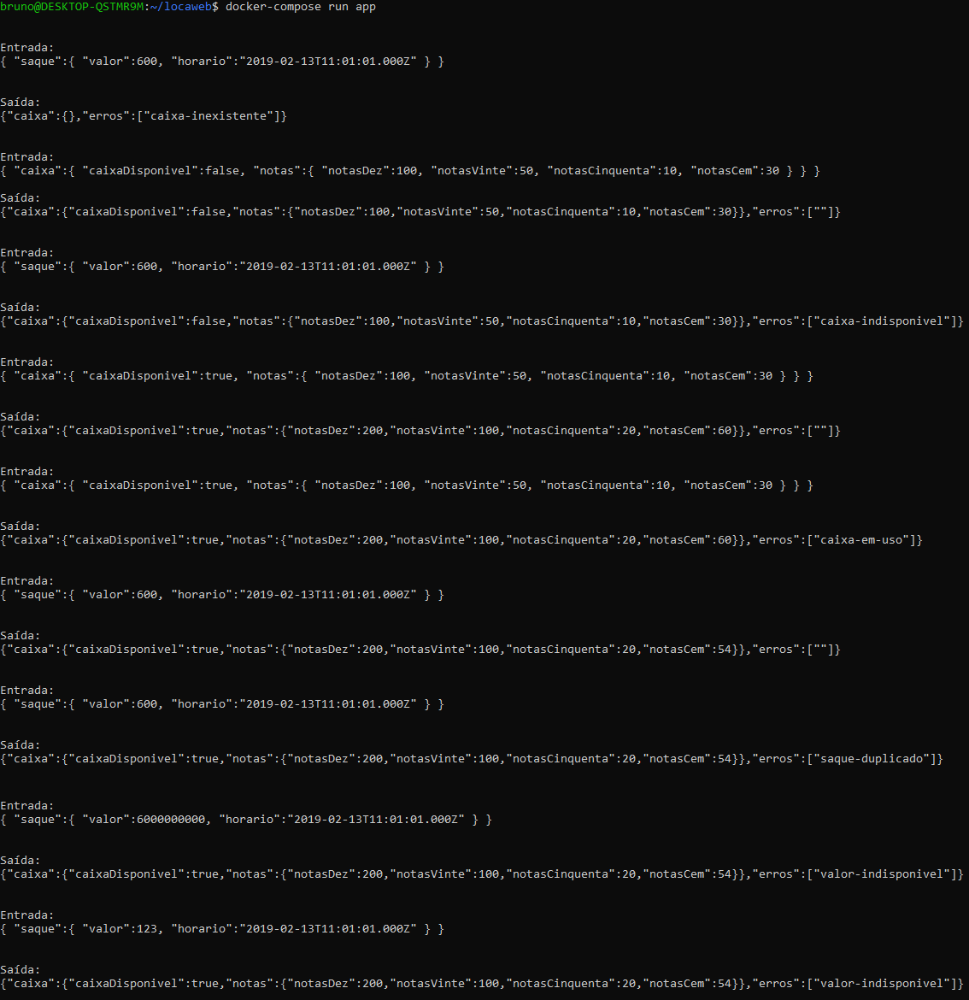

# Caixa Eletrônico

Esta aplicação simula funcionalidades de um caixa eletrônico, recebendo e retornando dados diretamente no console (stdin/stdout)

# Instalação

Este projeto conta com Docker, e, estando no diretório do projeto, pode ser configurado com o seguinte comando:

```
docker-compose build
```

Caso prefira utilizar o Ruby nativo da máquina, também no diretório do projeto utilize o seguinte comando:

```
bundle install
```

# Como utilizar

A aplicação é iniciada pelo console através do arquivo `app.rb` com os seguinte comandos

#### Com Ruby nativo

```
ruby app.rb
```

#### Com Docker

```
docker-compose run app
```

As operações são inseridas em texto, no formato JSON, diretamente no terminal, e obrigatoriamente em *single line*. Ex:

Abastecimento:
```json
{ "caixa":{ "caixaDisponivel":false, "notas":{ "notasDez":100, "notasVinte":50, "notasCinquenta":10, "notasCem":30 } } }
```

Saque:
```json
{ "saque":{ "valor":600, "horario":"2019-02-13T11:01:01.000Z" } }
```

A aplicação também conta com testes unitários, que podem ser verificados com os seguintes comandos

#### Com Ruby nativo

Para rodar todos os testes:

```
rspec
```

Para rodar testes específicos, o *path* e a linha do arquivos devem ser adicionados após o comando rspec. Ex:

```
rspec spec/services/recharge_atm_service_spec.rb:21
```

#### Com Docker

Para rodar todos os testes:

```
docker-compose run app rspec
```

Para rodar testes específicos, o *path* e a linha do arquivos devem ser adicionados após o comando rspec. Ex:

```
docker-compose run app rspec spec/services/recharge_atm_service_spec.rb:21
```

# Cenários de utilização

A seguir serão descritas as possibilidades de cenários de sucesso e erro, bem como os dados para simulá-los.

Como a aplicação depende somente de armazenamento em memória, caso ela seja encerrada todos os dados serão perdidos.
O fluxo a seguir considera que a aplicação terá funcionamento continuo até o final dos testes.

## Iniciar a aplicação

```
docker-compose run app
```

## Saque inválido pelo caixa ser inexistente

Entrada:
```json
{ "saque":{ "valor":600, "horario":"2019-02-13T11:01:01.000Z" } }
```

Saída:
```json
{"caixa":{},"erros":["caixa-inexistente"]}
```

## Recarga válida mantendo o caixa indisponível

Entrada:
```json
{ "caixa":{ "caixaDisponivel":false, "notas":{ "notasDez":100, "notasVinte":50, "notasCinquenta":10, "notasCem":30 } } }
```

Saída:
```json
{"caixa":{"caixaDisponivel":false,"notas":{"notasDez":100,"notasVinte":50,"notasCinquenta":10,"notasCem":30}},"erros":[""]}
```

## Saque inválido pelo caixa esta indisponível

Entrada:
```json
{ "saque":{ "valor":600, "horario":"2019-02-13T11:01:01.000Z" } }
```

Saída:
```json
{"caixa":{"caixaDisponivel":false,"notas":{"notasDez":100,"notasVinte":50,"notasCinquenta":10,"notasCem":30}},"erros":["caixa-indisponivel"]}
```

## Recarga válida tornando o caixa disponível

Entrada:
```json
{ "caixa":{ "caixaDisponivel":true, "notas":{ "notasDez":100, "notasVinte":50, "notasCinquenta":10, "notasCem":30 } } }
```

Saída:
```json
{ "caixa":{ "caixaDisponivel":true, "notas":{ "notasDez":100, "notasVinte":50, "notasCinquenta":10, "notasCem":30 } } }
```

## Recarga inválida pelo caixa estar disponível para uso

Entrada:
```json
{ "caixa":{ "caixaDisponivel":true, "notas":{ "notasDez":100, "notasVinte":50, "notasCinquenta":10, "notasCem":30 } } }
```

Saída:
```json
{"caixa":{"caixaDisponivel":true,"notas":{"notasDez":200,"notasVinte":100,"notasCinquenta":20,"notasCem":60}},"erros":["caixa-em-uso"]}
```

## Saque válido

Entrada:
```json
{ "saque":{ "valor":600, "horario":"2019-02-13T11:01:01.000Z" } }
```

Saída:
```json
{"caixa":{"caixaDisponivel":true,"notas":{"notasDez":200,"notasVinte":100,"notasCinquenta":20,"notasCem":54}},"erros":[""]}
```

## Saque inválido por duplicidade

Entrada:
```json
{ "saque":{ "valor":600, "horario":"2019-02-13T11:01:01.000Z" } }
```

Saída:
```json
{"caixa":{"caixaDisponivel":true,"notas":{"notasDez":200,"notasVinte":100,"notasCinquenta":20,"notasCem":54}},"erros":["saque-duplicado"]}
```

## Saque inválido por valor acima do disponível

Entrada:
```json
{ "saque":{ "valor":6000000000, "horario":"2019-02-13T11:01:01.000Z" } }
```

Saída:
```json
{"caixa":{"caixaDisponivel":true,"notas":{"notasDez":200,"notasVinte":100,"notasCinquenta":20,"notasCem":54}},"erros":["valor-indisponivel"]}
```

## Saque inválido por valor com notas inexistentes

Entrada:
```json
{ "saque":{ "valor":123, "horario":"2019-02-13T11:01:01.000Z" } }
```

Saída:
```json
{"caixa":{"caixaDisponivel":true,"notas":{"notasDez":200,"notasVinte":100,"notasCinquenta":20,"notasCem":54}},"erros":["valor-indisponivel"]}
```

## Printscreen ilustrando os cenários em sequência


